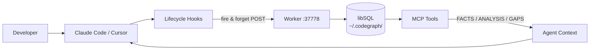

# claude-lore

AI coding agents start every session cold. They re-explore decisions already made, propose
changes that violate constraints established last week, and have no awareness of how a
change in one repo breaks another. claude-lore fixes this by maintaining a queryable
knowledge graph that agents load at session start — a structural layer tracking what the
code does, and a reasoning layer tracking why it is the way it is.

---

## How it works

### Two layers

The **structural layer** maps what the code does: symbols, call graphs, and blast radius.
The **reasoning layer** captures why: architectural decisions, deferred work, known risks,
and session state. Records are confidence-scored (`confirmed | extracted | inferred |
contested`) and visibility-tiered (`personal | private | shared | public | redacted`).

### Hook lifecycle

Five lifecycle hooks capture context automatically. No manual input required during normal
development. The hooks fire-and-forget — they never block Claude Code or Cursor operations.



At `SessionStart`, prior context is injected as a system message. At `Stop`, the
compression pass extracts decisions, deferred work, and risks from raw observations
using Claude. At `SessionEnd`, the session is marked complete.

### MCP tools

Agents query the graph via MCP — available to both Claude Code and Cursor:

- `reasoning_get` / `reasoning_log` — decisions, risks, deferred work
- `session_load` / `session_search` — session history and current state
- `personal_log` / `personal_get` — developer-only notes, never synced
- `portfolio_deps` / `portfolio_impact` / `portfolio_context` — cross-repo awareness
- `review_map` — visual codebase map (HTML), nodes coloured by reasoning coverage
- `review_diff` — pre-commit review with reasoning overlay on current git diff
- `review_propagation` — transitive impact view for a given file

---

## Install

**Prerequisites:** [Bun](https://bun.sh), [pnpm](https://pnpm.io), [PM2](https://pm2.keymetrics.io)

```bash
npm install -g pm2
git clone https://github.com/martzza/claude-lore
cd claude-lore
pnpm install
pm2 start ecosystem.config.js
curl http://127.0.0.1:37778/health
# → {"status":"ok","port":37778,...}
```

---

## Connect a repo (Claude Code)

```bash
# In your target repo
cp /path/to/claude-lore/templates/claude-settings.json .claude/settings.json

# Replace CLAUDE_LORE_PATH with the absolute path to your claude-lore directory
# macOS / Linux
sed -i '' "s|\${CLAUDE_LORE_PATH}|$(pwd -P)|g" .claude/settings.json
# (run from the claude-lore directory, not the target repo)
```

Then restart Claude Code. The hooks are registered automatically.

---

## Connect a repo (Cursor)

```bash
# In your target repo
cp /path/to/claude-lore/templates/cursor-hooks.json .cursor/hooks.json
cp /path/to/claude-lore/templates/cursor-mcp.json   .cursor/mcp.json

LORE_PATH=/absolute/path/to/claude-lore
sed -i '' "s|\${CLAUDE_LORE_PATH}|$LORE_PATH|g" .cursor/hooks.json .cursor/mcp.json
```

Then restart Cursor.

---

## Bootstrap a repo

Pre-populate the reasoning layer before the first session so agents start with context
instead of a blank slate.

```bash
cd your-repo
claude-lore init          # adds .codegraph/ and hook registration
claude-lore bootstrap     # interactive wizard

# Use the OWASP Top 10 template for security defaults
claude-lore bootstrap --framework owasp-top10

# Preview without writing
claude-lore bootstrap --dry-run

# See all available templates
claude-lore bootstrap --list
```

---

## Visual review tools

Three CLI commands open interactive HTML views in your browser. Each node in the map
is coloured by reasoning coverage — red for risks, blue for decisions, amber for
deferred work, grey for no reasoning. Clicking a node opens a side panel with three
tabs: **Annotations** (full records), **Code** (source with lines highlighted by record
type — red for risks, blue for decisions, amber for deferred), and **Deps** (imports
and dependents).

```bash
# Full codebase map — force or radial layout
claude-lore review-map
claude-lore review-map --layout radial

# Pre-commit review: reasoning overlay on your current git diff
claude-lore review-diff
claude-lore review-diff --base main

# Transitive impact view: which files break if this one changes?
claude-lore review-propagation src/auth/middleware.ts

# Output JSON instead of opening a browser
claude-lore review-map --format mermaid
claude-lore review-diff --format json
```

These are also available as MCP tools (`review_map`, `review_diff`,
`review_propagation`) so agents can generate and inspect them directly.

---

## Using the graph in sessions

Once connected, use `/lore` inside Claude Code:

```
/lore what did we decide about the database driver?
→ FACTS: @libsql/client chosen over better-sqlite3 because better-sqlite3 fails under Bun.
         *(id: dec-db-001, confidence: confirmed)*
  ANALYSIS: This is the correct choice given Bun as the runtime.
  GAPS: No record of performance benchmarks between the two drivers.

/lore what breaks if I change authMiddleware?
/lore what was in progress last session?
/lore save we decided to add rate limiting before public launch
```

Generate documentation:

```
/doc runbook
/doc architecture
/doc adr authMiddleware
/doc onboarding
```

---

## Team setup (Turso remote sync)

By default claude-lore uses local libSQL files. To sync across a team:

```bash
# Set Turso credentials (one time per developer)
export CLAUDE_LORE_TURSO_URL=libsql://your-db.turso.io
export CLAUDE_LORE_TURSO_AUTH_TOKEN=your-token
pm2 restart claude-lore-worker

# Generate per-developer auth tokens
claude-lore auth generate alice --scopes read,write:sessions,write:decisions
claude-lore auth list
```

Each developer has their own token. `personal.db` is never synced — it stays local.

---

## Writing your own bootstrap template

See [TEMPLATES.md](TEMPLATES.md) for the full contributor guide.

---

## Contributing

Fork the repo, make your changes on a branch, and open a PR.

Built-in templates (in `packages/worker/src/services/bootstrap/templates/`) must cover
widely-used standards or frameworks — not company-specific rules. Company-specific
templates belong in `~/.codegraph/templates/` (user-local) or `{repo}/.codegraph/templates/`
(repo-local).

Before submitting:

```bash
pnpm install
bun run packages/cli/src/ci.ts   # CI checks must pass
```

---

## License

MIT
