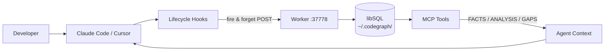

# claude-lore

AI coding agents start every session cold. They re-explore decisions already made,
propose changes that violate constraints established last week, and have no awareness
of how a change in one repo breaks another.

claude-lore fixes this by giving agents a persistent memory of your codebase —
not just what the code does, but **why** it is the way it is. Every decision,
deferred item, and known risk is stored in a local knowledge graph that agents
load at session start. They arrive warm, not cold.

---

## Why this reduces your AI costs

Every token your agent spends re-establishing context is a token you pay for and
wait on. Cold sessions are expensive sessions.

### The cold-start problem

Without memory, a typical session looks like this:

1. Agent reads your CLAUDE.md (hundreds to thousands of tokens)
2. Agent re-reads files it touched last session to remember where things stand
3. Agent asks about decisions you explained last week
4. Agent proposes a change you already ruled out

With claude-lore, sessions start with a targeted context injection — only the
decisions, risks, and deferred items relevant to this repo, compressed from prior
sessions. Agents skip the re-exploration and go straight to productive work.

### Measured results

Tested against a real-world JavaScript project (~9,000 lines of code across
~70 files) using static analysis of cold vs warm exploration paths for five
typical architectural questions.

| Session type | Context approach | Estimated tokens |
|---|---|---|
| Cold | Read relevant files from scratch | ~10,000–15,000 per question |
| Warm (claude-lore) | Inject compressed graph records | ~1,500–2,000 per question |

Estimated **60–70% reduction** in context tokens for architectural questions
where the answer is already captured in the graph.

The largest single driver in the test codebase was one 400-line core engine file
(~10,000 tokens). With claude-lore, agents receive a 2–3 sentence compressed
record instead of reading the file. Questions answered correctly in both cases —
the warm session just costs significantly less.

These are static analysis estimates, not live benchmark results. Actual savings
depend on codebase structure, question type, and how well the graph has been
populated.

### CLAUDE.md token optimisation

Your CLAUDE.md file is loaded on every single prompt. Sections that duplicate
what's already in the knowledge graph (decisions made, constraints documented)
waste tokens on every interaction.

`claude-lore advisor claudemd` analyses your CLAUDE.md and identifies:

- Sections that duplicate confirmed graph records (can be removed or shrunk)
- Sections that could be replaced with a single `/lore` query
- Outdated entries that no longer reflect the codebase
- Missing sections the graph knows about but CLAUDE.md doesn't mention

Trimming 500 tokens from CLAUDE.md saves those 500 tokens on **every prompt**
in every future session.

### Parallelism detection

Deferred work items often have hidden dependencies. The advisor analyses your
backlog and identifies which tasks can safely run in parallel subagents vs which
must run serially, and generates ready-to-paste subagent prompts.

```bash
claude-lore advisor parallel --from-deferred
# → Parallel groups: 3  (estimated 2.4x speedup)
#   Group 1: 2 task(s) — safe because: no shared symbols, independent file trees
```

---

## How it works

### Two layers

The **structural layer** maps what the code does: symbols, call graphs, blast radius.

The **reasoning layer** captures why: architectural decisions, deferred work, known
risks, and session state. Records are confidence-scored and visibility-tiered.

**Confidence levels**

| Level | Source | How agents present it |
|---|---|---|
| `confirmed` | Human-reviewed via `claude-lore review` | Stated as fact with citation |
| `extracted` | AI compression at session end | "session records suggest..." |
| `inferred` | Bootstrap importer / templates | "inferred from documentation..." |
| `contested` | Conflicting records exist | Surfaces conflict, picks no winner |

**Visibility tiers**

| Tier | Where stored | Synced? |
|---|---|---|
| `personal` | `~/.codegraph/personal.db` | Never — developer-only |
| `private` | `{repo}/.codegraph/reasoning.db` | Within the team |
| `shared` | Global registry | Named dependencies only |
| `public` | Global registry | All repos in portfolio |

### Hook lifecycle

Five hooks capture context automatically. They fire-and-forget — they never block
Claude Code or Cursor operations.



`SessionStart` — injects prior context as a system message
`UserPromptSubmit` — detects decision/risk/deferral keywords inline
`PostToolUse` — logs file edits and shell observations
`Stop` — AI compression pass: extracts decisions, risks, deferred from raw observations
`SessionEnd` — marks session complete

---

## The advisor

`claude-lore advisor` runs five analyses in parallel and surfaces the most important
actions across all of them.


```bash
claude-lore advisor          # full summary across all five
```

### Knowledge gaps

Identifies symbols and files that have activity in the session log but no reasoning
records — places where decisions were made but never documented.

```bash
claude-lore advisor gaps
```

### CLAUDE.md optimisation

Analyses your CLAUDE.md for token waste, redundant sections, and missing entries.

```bash
claude-lore advisor claudemd           # report
claude-lore advisor claudemd --apply   # apply safe optimisations
```

### Skill gap analysis

Reviews the last N sessions to identify patterns that suggest a missing skill.
If the same kind of task appears repeatedly with no skill handling it, the advisor
names the skill and generates a stub file for it.

```bash
claude-lore advisor skills                      # last 30 sessions
claude-lore advisor skills --days 60            # wider window
claude-lore advisor skills --generate auth-flow # generate skill stub
```

### Parallelism opportunities

Looks at open deferred work and identifies which tasks can safely run in parallel
subagents. Generates ready-to-paste subagent prompts.

```bash
claude-lore advisor parallel                         # from deferred work
claude-lore advisor parallel --tasks "add tests,fix auth,update docs"
```

### Workflow intelligence

Detects patterns across session history — repeated re-exploration, context thrash,
unconfirmed records piling up — and recommends process changes.

```bash
claude-lore advisor workflow            # last 60 sessions
claude-lore advisor workflow --days 30
```

---

## Visual review tools

Three CLI commands open interactive HTML views in your browser. Nodes are coloured
by reasoning coverage — **red** for risks, **blue** for decisions, **amber** for
deferred work, **grey** for no reasoning. Clicking a node opens a side panel with
source code highlighted in the same colour scheme.

### Codebase map


```bash
claude-lore review-map
claude-lore review-map --layout radial
```

Click any node to open the side panel:
- **Annotations** — full decision / risk / deferred records attached to this file
- **Code** — source with lines highlighted red (risk), blue (decision), or amber (deferred)
- **Deps** — imports and dependents, clickable to navigate the graph

Filter dropdown: All files | Has reasoning | Has risks | Entry points

### Pre-commit diff review


```bash
claude-lore review-diff               # staged changes vs HEAD
claude-lore review-diff --base main   # all changes since main
```

Shows your git diff with relevant reasoning records surfaced inline — so you can
see which known risks and decisions touch the lines you're about to commit.

### Propagation view


```bash
claude-lore review-propagation src/auth/middleware.ts
```

Shows the transitive blast radius of changing a file — which files import it,
which import those, layered by depth.

---

## Bootstrap: pre-populating the graph

Before your first session, bootstrap scans existing documentation and templates
to give agents context from day one.


```bash
cd your-repo
claude-lore init        # creates .codegraph/, registers hooks, Quick/Full setup prompt
claude-lore bootstrap   # interactive wizard
```

`init` offers a **Quick** (solo, ~2 min) or **Full** (team + Turso) setup path
on first run. Both give you the complete knowledge graph — the only difference is
whether Turso remote sync is configured. You can change this later with
`claude-lore mode set team`.

The bootstrap wizard:
1. Scans `.md` files, ADRs, git history — extracts decisions, risks, deferred items
2. Analyses your CLAUDE.md and suggests improvements
3. Presents security and compliance templates (OWASP Top 10, etc.) with a preview
4. Confirms before writing — shows type breakdown and record count
5. Shows a team-sync hint if Turso isn't yet configured

```bash
claude-lore bootstrap --framework owasp-top10   # specific template
claude-lore bootstrap --dry-run                 # preview without writing
claude-lore bootstrap --list                    # list available templates
```

All bootstrapped records start as `confidence: inferred`. You promote them to
`confirmed` over time with `claude-lore review`.

---

## Auditing bootstrap accuracy

Bootstrap reads documentation and extracts records — but docs describe intent,
not always reality. The audit command cross-checks bootstrap claims against
actual code and flags gaps for review.

```bash
claude-lore audit --estimate   # preview: file count, record count, estimated cost
claude-lore audit --grep-only  # run: grep verification only, no API key required
claude-lore audit              # run: grep + LLM verification for ambiguous cases
```

The audit classifies each imported record as verified (code found), ambiguous
(weak match), or a gap (no code evidence). Gap records are written with
`pending_review=1` and surfaced in both `claude-lore review` and `/lore audit`
inside Claude Code.

In testing on this repo (87 inferred records):
- **82 records** grep-verified in under 10 seconds
- **5 gap candidates** flagged for review
- **Estimated cost** for a full LLM pass: ~$0.08

If bootstrap detects significant behavioral claims (always/never/must patterns)
or the repo has an established commit history, it will suggest running an audit
automatically at the end of the wizard.

---

## Using the graph in sessions

Once connected, use `/lore` inside Claude Code:


```
/lore what did we decide about the database driver?
→ FACTS: @libsql/client chosen over better-sqlite3 because better-sqlite3 fails under Bun.
         *(id: dec-db-001, confidence: confirmed)*
  ANALYSIS: This is the correct choice given Bun as the runtime.
  GAPS: No record of performance benchmarks between the two drivers.

/lore what breaks if I change authMiddleware?
/lore what was in progress last session?
/lore save we decided to add rate limiting before public launch

/lore improve    → advisor: highest-priority action right now
/lore workflow   → patterns and workflow recommendations from session history
/lore skills     → skill gap suggestions based on session patterns
/lore parallel   → which open work items can run in parallel subagents
```

Generate documentation grounded entirely in graph records:

```
/doc runbook
/doc architecture
/doc adr authMiddleware
/doc onboarding
/doc api src/auth/middleware.ts
```

Visual review:

```
/review map
/review diff
/review propagation src/auth/middleware.ts
```

---

## Confirming records

Records extracted automatically start as `inferred` or `extracted`. Confirm the
ones that matter so agents treat them as ground truth:

```bash
claude-lore review
```

The review CLI walks you through pending records one at a time:

```
[1/12] decision  (confidence: extracted)
  session records suggest: switched from REST to tRPC for end-to-end type safety

  [c] confirm   [e] edit   [d] discard   [s] skip   [q] quit
```

Confirmed records carry more weight in agent context and are cited directly
rather than prefixed with "session records suggest:".

---

## Personal layer

Some notes belong only to you — not to the team, not to CI. There are two kinds:

**Global memories** — cross-repo, injected into every session regardless of which
repo you're working in. Managed via `claude-lore remember` (see
[Persistent personal notes](#persistent-personal-notes) above).

**Personal reasoning records** — repo-scoped, structured, confidence-scored.
Use these for developer-specific observations about a specific codebase:

```
/lore save [personal] I suspect the auth refactor introduced a subtle race condition
```

Both are stored in `~/.codegraph/personal.db`, outside any repo, and are never
synced in either solo or team mode. Access control is enforced by file location,
not permissions logic.

---

## Skills

### Built-in skills (installed by claude-lore)

| Trigger | Skill | What it does |
|---|---|---|
| `/lore` | `kg-query` | Query decisions, risks, deferred work, session history |
| `/lore audit` | `audit` | Review audit gap records inline without leaving Claude Code |
| `/doc` | `kg-doc` | Generate runbooks, architecture docs, ADRs, onboarding guides |
| `/review` | `review` | Open visual codebase map, diff review, propagation view |

### Discovering more skills

```bash
claude-lore skills suggest    # claude-lore skills + well-paired Claude Code skills
claude-lore skills --onboarding    # compare your skills against the team's canonical set
claude-lore skills install <name>  # install a canonical team skill
```

The `suggest` command shows built-in Claude Code skills that pair well (like
`commit`, `review-pr`, `simplify`) and community marketplace pairings, with
install instructions for each.

The advisor's `skills` sub-command goes further — it analyses your session
history to identify repeated patterns that suggest a missing skill, then generates
a stub file with the right `reasoning_get` / `session_load` calls already wired in.

---

## Install

**Prerequisites:** [Bun](https://bun.sh), [pnpm](https://pnpm.io), [PM2](https://pm2.keymetrics.io)

```bash
npm install -g pm2
git clone https://github.com/martzza/claude-lore
cd claude-lore
pnpm install
pm2 start ecosystem.config.js
curl http://127.0.0.1:37778/health
# → {"status":"ok","port":37778,...}
```

### Connect a repo (Claude Code)

```bash
cd your-repo
claude-lore init
```

On first run, `init` asks whether you want **Quick** or **Full** setup:

- **Quick (default)** — sets solo mode, skips all sync configuration, done in under 2 minutes. Everything works immediately: hooks, context injection, knowledge graph.
- **Full** — sets team mode, walks you through Turso remote sync setup interactively.

You can switch modes at any time — see [Solo and team modes](#solo-and-team-modes) below.

After init, store things Claude should always know, across every repo:

```bash
claude-lore remember "always use postgres 16, never downgrade to 15"
claude-lore remember "prefer pnpm over npm in all scripts" --tag tooling
```

Then run the bootstrap wizard to pre-populate the knowledge graph from your existing docs:

```bash
claude-lore bootstrap
```

### Connect a repo (Cursor)

```bash
# In your target repo
cp /path/to/claude-lore/templates/cursor-hooks.json .cursor/hooks.json
cp /path/to/claude-lore/templates/cursor-mcp.json   .cursor/mcp.json

LORE_PATH=/absolute/path/to/claude-lore
sed -i '' "s|\${CLAUDE_LORE_PATH}|$LORE_PATH|g" .cursor/hooks.json .cursor/mcp.json
```

Then restart Cursor.

---

## Solo and team modes

claude-lore runs in one of two modes, stored in `~/.codegraph/config.json`.

```bash
claude-lore mode              # show current mode
claude-lore mode set solo     # local-only, no auth required
claude-lore mode set team     # Turso sync + auth tokens
```

**Solo mode** is the default. Everything runs locally. No tokens, no sync config,
no Turso account needed. Full capability — service scoping, cross-repo portfolio,
monorepo detection — all work identically.

**Team mode** enables Turso remote sync and requires auth tokens for write
operations. Switch to team mode when you need shared decisions to be visible
across multiple developers.

`mode set team` will prompt for Turso credentials if they are not already
configured, or you can configure first:

```bash
# Create a free database at https://turso.tech, then:
claude-lore mode set team
```

To generate per-developer auth tokens once in team mode:

```bash
claude-lore auth generate alice --scopes read,write:sessions,write:decisions
claude-lore auth list
```

`personal.db` is never synced in either mode — it stays at
`~/.codegraph/personal.db` and never leaves the machine.

---

## Persistent personal notes

Store facts Claude should always know, across every repo and every session:

```bash
claude-lore remember "always use postgres 16"
claude-lore remember "SSH jump alias: jump-prod" --tag infra
claude-lore remember "prefer pnpm over npm" --tag tooling
```

These are injected at the top of every session context, before any repo-specific
information — regardless of which repo you're working in.

```bash
claude-lore memories              # list injected memories
claude-lore memories --all        # include paused
claude-lore memories --tag infra  # filter by tag
claude-lore forget <id>           # delete by short id (first 8 chars)
claude-lore forget --tag tooling  # delete all with a tag
claude-lore memory pause <id>     # stop injecting without deleting
claude-lore memory resume <id>    # re-enable injection
```

This is separate from the structured reasoning layer (decisions, risks, deferred
work). Global memories are free-form — use them for developer preferences,
environment facts, and anything else Claude should carry into every conversation.

---

## MCP tools reference

Available to both Claude Code and Cursor agents:

| Tool | Purpose |
|---|---|
| `reasoning_get` / `reasoning_log` | Read / write decisions, risks, deferred work |
| `session_load` / `session_search` | Session history and current open state |
| `personal_log` / `personal_get` | Developer-only notes, never synced |
| `codegraph_context` | Primary structural entry point |
| `codegraph_impact` / `codegraph_callers` | Blast radius and caller graph |
| `portfolio_deps` / `portfolio_impact` / `portfolio_context` | Cross-repo awareness |
| `review_map` | Codebase dependency map (HTML or JSON summary) |
| `review_diff` | Pre-commit reasoning overlay on git diff |
| `review_propagation` | Transitive impact view for a given file |

---

## Full CLI reference

```bash
# Setup
claude-lore init                          # initialise repo — Quick or Full setup on first run
claude-lore bootstrap                     # interactive bootstrap wizard
claude-lore bootstrap --framework <name>  # specific template
claude-lore bootstrap --dry-run           # preview without writing
claude-lore bootstrap --list              # list available templates

# Mode
claude-lore mode                          # show current mode (solo | team)
claude-lore mode set solo                 # local-only, no auth required
claude-lore mode set team                 # enable Turso sync + auth tokens

# Persistent personal notes (cross-repo, always injected)
claude-lore remember "<text>" [--tag]     # store a fact Claude should always know
claude-lore memories [--tag] [--all]      # list stored notes
claude-lore forget [<id>] [--tag]         # delete by short id or tag
claude-lore memory pause <id>             # stop injecting without deleting
claude-lore memory resume <id>            # re-enable injection

# Review & confirm
claude-lore review                        # walk through pending extracted records

# Audit
claude-lore audit                         # full audit: grep + LLM verification
claude-lore audit --estimate              # cost preview (no API key, instant)
claude-lore audit --grep-only             # grep only, no LLM
claude-lore audit --resume <id>           # resume a paused audit session
claude-lore audit --dry-run               # run without writing gap records

# Advisor
claude-lore advisor                       # full summary (all five analyses)
claude-lore advisor gaps                  # knowledge coverage gaps
claude-lore advisor claudemd [--apply]    # CLAUDE.md token optimisation
claude-lore advisor skills [--generate]   # skill gap analysis from session patterns
claude-lore advisor parallel              # parallelism opportunities from deferred work
claude-lore advisor workflow [--days N]   # workflow patterns and recommendations

# Visual review
claude-lore review-map [--layout radial]  # codebase dependency map
claude-lore review-diff [--base <ref>]    # pre-commit reasoning overlay
claude-lore review-propagation <file>     # transitive impact view

# Skills
claude-lore skills                        # index and conflict count
claude-lore skills --diff                 # drift across repos
claude-lore skills --onboarding           # team alignment check
claude-lore skills suggest                # discovery: claude-lore + paired skills
claude-lore skills install [name]         # install canonical team skill

# Worker
claude-lore worker start|stop|restart|status

# Auth (team mode)
claude-lore auth generate <author> [--scopes ...]
claude-lore auth list
claude-lore auth revoke <token>

# Sync (team mode)
claude-lore sync status
claude-lore sync now
claude-lore sync conflicts [--resolve <id>]
```

---

## Writing your own bootstrap template

See [TEMPLATES.md](TEMPLATES.md) for the full contributor guide.

---

## Contributing

Fork the repo, make your changes on a branch, and open a PR.

Built-in templates (in `packages/worker/src/services/bootstrap/templates/`) must
cover widely-used standards or frameworks — not company-specific rules.
Company-specific templates belong in `~/.codegraph/templates/` (user-local) or
`{repo}/.codegraph/templates/` (repo-local).

Before submitting:

```bash
pnpm install
bun run packages/cli/src/ci.ts   # CI checks must pass
```

---

## License

MIT
